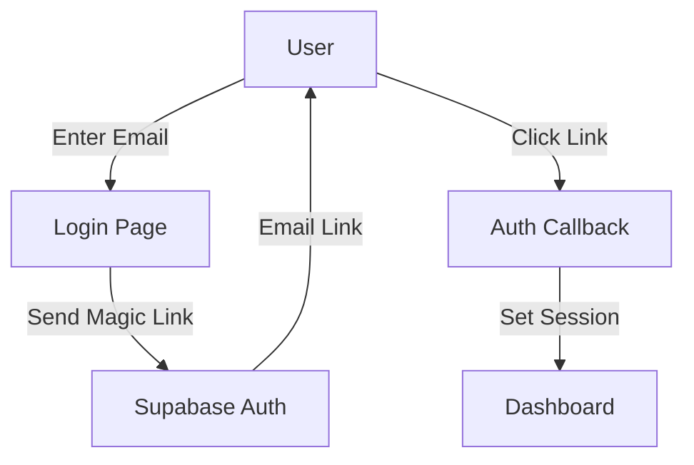
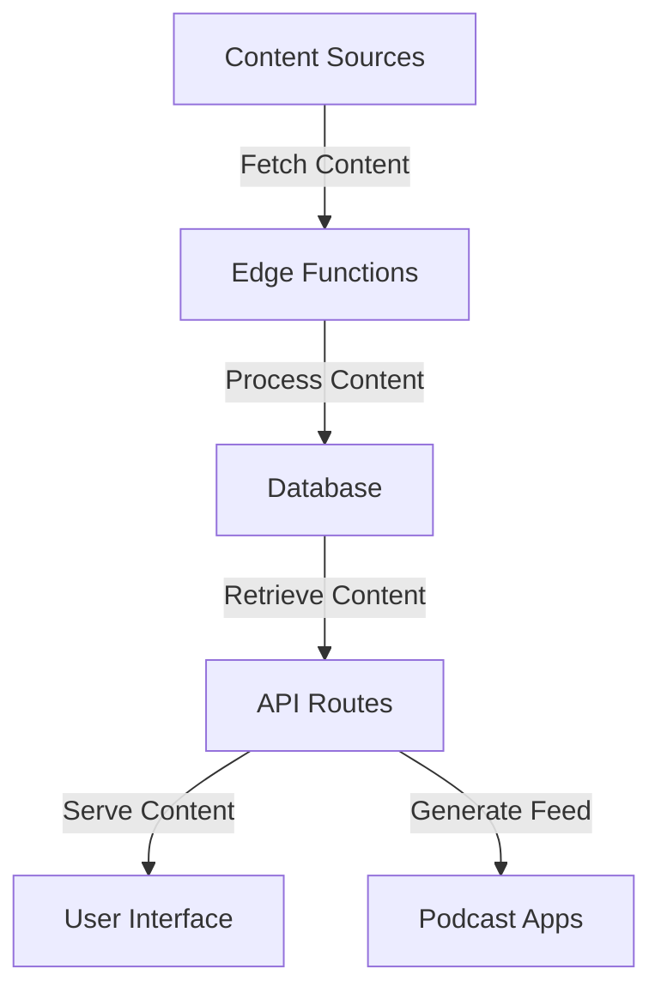
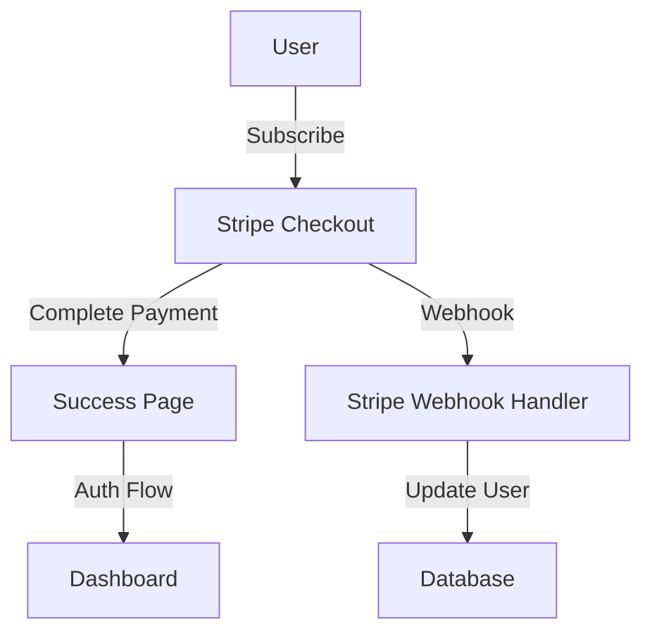

# Speasy Codebase Overview

This document provides a high-level overview of the Speasy application architecture, including key components, data flows, and dependencies.

## Architecture

Speasy is built using the following technologies:

- **Frontend**: Next.js with App Router, React
- **Backend**: Next.js API routes, Supabase Edge Functions
- **Database**: Supabase (PostgreSQL)
- **Authentication**: Supabase Auth
- **Payments**: Stripe
- **Deployment**: Vercel

## Key Components

### User Authentication

The authentication system:
- Uses Next.js middleware to protect routes
- Implements passwordless authentication with magic links
- Automatically redirects users based on authentication state

```typescript
export async function middleware(req: NextRequest) {
  const res = NextResponse.next()
  const supabase = createMiddlewareClient({ req, res })

  // Handle auth error parameters in the URL hash
  const url = new URL(req.url)
  if (url.hash && url.hash.includes('error=')) {
    const errorParams = new URLSearchParams(url.hash.substring(1))
    const error = errorParams.get('error')
    const errorCode = errorParams.get('error_code')
    const errorDescription = errorParams.get('error_description')

    if (error || errorCode || errorDescription) {
      const errorUrl = new URL('/auth/error', req.url)
      errorUrl.searchParams.set('error', error || '')
      errorUrl.searchParams.set('error_code', errorCode || '')
      errorUrl.searchParams.set('error_description', errorDescription || '')
      return NextResponse.redirect(errorUrl)
    }
  }

  // Refresh session
  const { data: { session } } = await supabase.auth.getSession()

  // Protected routes
  if (req.nextUrl.pathname.startsWith('/dashboard')) {
    if (!session) {
      return NextResponse.redirect(new URL('/auth/login', req.url))
    }
  }

  // Auth routes
  if (req.nextUrl.pathname.startsWith('/auth/login')) {
    if (session) {
      return NextResponse.redirect(new URL('/dashboard', req.url))
    }
  }

  return res
}
```

### Subscription Management

The subscription system:
- Processes Stripe webhooks to update user subscription status
- Manages user access based on subscription status
- Handles subscription creation, updates, and cancellations

```typescript
export async function POST(request: Request) {
  const body = await request.text();
  const signatureHeader = request.headers.get('stripe-signature');
  const supabase = createAdminClient();
  
  if (!signatureHeader) {
    return NextResponse.json(
      { error: 'No stripe-signature header found' },
      { status: 400 }
    );
  }

  let event;

  try {
    // Verify webhook signature
    event = stripe.webhooks.constructEvent(
      body,
      signatureHeader,
      process.env.STRIPE_WEBHOOK_SECRET!
    );
  } catch (error: any) {
    console.error(`Webhook signature verification failed: ${error.message}`);
    return NextResponse.json({ error: error.message }, { status: 400 });
  }

  // Handle the event based on its type
  switch (event.type) {
    case 'checkout.session.completed':
      const session = event.data.object;
      await handleCheckoutSessionCompleted(session, supabase);
      break;
    case 'customer.subscription.created':
    case 'customer.subscription.updated':
      const subscription = event.data.object;
      await handleSubscriptionUpdated(subscription, supabase);
      break;
    default:
      console.log(`Unhandled event type: ${event.type}`);
  }

  return NextResponse.json({ received: true });
}
```

### Content Processing

Content is processed through several stages:
1. Retrieval from original sources
2. Text extraction and processing
3. Audio generation
4. Storage and serving

Edge functions handle content processing in the background:
- `process_llm_job`: Processes text into audio
- `refresh_feeds`: Updates content from sources

### Podcast Feed Generation

The feed generation system:
- Creates standard RSS feeds with podcast extensions
- Personalizes content based on user preferences
- Serves feeds via unique, private URLs

```typescript
export async function generateRssFeedAsync(
  contentItems: ContentItem[],
  {
    title,
    description,
    userId,
    feedId, // ← real UUID, not 'default'
  }: {
    title: string
    description: string
    userId: string
    feedId: string
  }
): Promise<string> {
  const baseUrl = process.env.NEXT_PUBLIC_URL || 'https://speasy.app'
  const feedUrl = `${baseUrl}/api/feeds/${userId}/${feedId}`

  const now = new Date().toUTCString();

  const podcastItems = await Promise.all(
    contentItems
      .filter((item) => item.audio && item.audio.length > 0)
      .map(async (item) => {
        // Generate podcast item XML
      })
  );

  return `<?xml version="1.0" encoding="UTF-8"?>
<rss version="2.0" 
     xmlns:itunes="http://www.itunes.com/dtds/podcast-1.0.dtd"
     xmlns:content="http://purl.org/rss/1.0/modules/content/"
     xmlns:dc="http://purl.org/dc/elements/1.1/"
     xmlns:atom="http://www.w3.org/2005/Atom">
  <channel>
    <title>${escapeXml(title)}</title>
    <link>${CONFIG.getBaseUrl()}</link>
    <description><![CDATA[${description}]]></description>
    <language>en-us</language>
    <lastBuildDate>${now}</lastBuildDate>
    <generator>Speasy RSS Generator</generator>

    <itunes:author>Speasy</itunes:author>
    <itunes:summary><![CDATA[${description}]]></itunes:summary>
    <itunes:category text="Technology"/>
    <itunes:explicit>no</itunes:explicit>
    <itunes:owner>
      <itunes:name>Speasy</itunes:name>
      <itunes:email>hello@speasy.app</itunes:email>
    </itunes:owner>

    <image>
      <url>${CONFIG.urls.cover(userId)}</url>
      <title>${escapeXml(title)}</title>
      <link>${CONFIG.getBaseUrl()}</link>
    </image>
    <itunes:image href="${CONFIG.urls.cover(userId)}"/>

    <atom:link href="${CONFIG.urls.feed(userId, feedId)}" rel="self" type="application/rss+xml"/>

    ${podcastItems.join("\n")}
  </channel>
</rss>`;
}
```

### User Interface

The UI is organized into several main sections:
- **Public landing page**: Marketing, pricing, and auth pages
- **Dashboard**: Personalized content recommendations
- **Player**: Audio playback with controls
- **Settings**: User preferences and subscription management

## Data Flow

### Authentication Flow



### Content Flow



### Payment Flow



## Dependencies

### Frontend Dependencies
- **@supabase/auth-helpers-nextjs**: Supabase authentication helpers
- **@stripe/stripe-js**: Stripe JavaScript SDK
- **next**: React framework
- **react**: UI library
- **tailwindcss**: CSS framework

### Backend Dependencies
- **@supabase/supabase-js**: Supabase JavaScript SDK
- **stripe**: Stripe Node.js SDK
- **showdown**: Markdown to HTML conversion for podcast descriptions

### Development Dependencies
- **typescript**: Type checking
- **eslint**: Code linting
- **jest**: Testing framework

## Configuration

### Environment Variables

```
# Site URL
NEXT_PUBLIC_SITE_URL=https://your-domain.com

# Supabase
NEXT_PUBLIC_SUPABASE_URL=https://your-project-id.supabase.co
NEXT_PUBLIC_SUPABASE_ANON_KEY=your-anon-key
SUPABASE_SERVICE_ROLE_KEY=your-service-role-key

# Stripe
NEXT_PUBLIC_STRIPE_PUBLISHABLE_KEY=pk_live_your-key
STRIPE_SECRET_KEY=sk_live_your-key
STRIPE_WEBHOOK_SECRET=whsec_your-key
```
