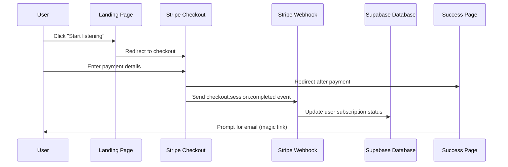

# Stripe Integration Guide

This document provides detailed instructions for setting up and configuring the Stripe payment integration for Speasy.

## Overview

The Speasy landing page integrates with Stripe to handle subscription payments. When a user clicks the "Start listening" button, they are redirected to a Stripe checkout page. After successful payment, they are redirected to a success page where a magic link is sent to their email to set up their account.

## Prerequisites

Before you begin, make sure you have:

1. A Stripe account
2. A Supabase project
3. Access to your hosting environment's environment variables

## Setup Instructions

### 1. Stripe Account Setup

1. **Create a Stripe Account**:
   - Sign up at [stripe.com](https://stripe.com) if you haven't already.
   - Complete the verification process.

2. **Create a Product and Price**:
   - Navigate to **Products** in your Stripe dashboard.
   - Click **Add Product**.
   - Set the product name to "Speasy Monthly Subscription".
   - Set the price to $5.00 USD monthly.
   - Save the product.
   - Note the **Price ID** (starts with `price_`).

3. **Get API Keys**:
   - Go to **Developers > API Keys** in your Stripe dashboard.
   - Copy the **Publishable key** (starts with `pk_`).
   - Copy the **Secret key** (starts with `sk_`).

4. **Set Up Webhook**:
   - Go to **Developers > Webhooks** in your Stripe dashboard.
   - Click **Add Endpoint**.
   - Set the endpoint URL to `https://your-domain.com/api/webhooks/stripe`.
   - Select the following events to listen for:
     - `checkout.session.completed`
     - `customer.subscription.created`
     - `customer.subscription.updated`
   - Click **Add Endpoint**.
   - Copy the **Signing Secret** (starts with `whsec_`).

### 2. Environment Variables Configuration

Add the following variables to your `.env.local` file:

```
NEXT_PUBLIC_STRIPE_PUBLISHABLE_KEY=pk_live_your_publishable_key
STRIPE_SECRET_KEY=sk_live_your_secret_key
STRIPE_WEBHOOK_SECRET=whsec_your_webhook_secret
STRIPE_PRICE_ID=price_your_price_id
```

Make sure to update each value with your actual Stripe keys.

### 3. Supabase Database Setup

1. Run the migration script to create the necessary tables:

```sql
-- Create users table if it doesn't exist
CREATE TABLE IF NOT EXISTS users (
  id UUID PRIMARY KEY DEFAULT gen_random_uuid(),
  email TEXT UNIQUE NOT NULL,
  created_at TIMESTAMP WITH TIME ZONE DEFAULT now(),
  updated_at TIMESTAMP WITH TIME ZONE DEFAULT now(),
  stripe_customer_id TEXT,
  subscription_status TEXT,
  subscription_end_date TIMESTAMP WITH TIME ZONE
);

-- Create or modify auth user trigger
CREATE OR REPLACE FUNCTION public.handle_new_user() 
RETURNS trigger AS $$
BEGIN
  INSERT INTO public.users (id, email)
  VALUES (new.id, new.email)
  ON CONFLICT (email) 
  DO UPDATE SET
    id = EXCLUDED.id;
  RETURN new;
END;
$$ LANGUAGE plpgsql SECURITY DEFINER;

-- Make sure trigger exists
DROP TRIGGER IF EXISTS on_auth_user_created ON auth.users;
CREATE TRIGGER on_auth_user_created
  AFTER INSERT ON auth.users
  FOR EACH ROW EXECUTE PROCEDURE public.handle_new_user();
```

You can run this either through the Supabase SQL editor or by using the migration file at `supabase/migrations/20250428_users_stripe.sql`.

### 4. Checkout Button Configuration

The "Start listening" button in the hero section is already configured to use your Stripe checkout URL directly:

```typescript
// utils/stripe.ts
export const redirectToStripeCheckout = () => {
  // Your Stripe checkout URL
  const stripeCheckoutUrl = 'https://buy.stripe.com/dR6cOdfi43Q63Ru7st';
  window.location.href = stripeCheckoutUrl;
};
```

If you want to use the dynamic checkout session creation instead (which allows for more flexibility):

1. Comment out the direct URL in `utils/stripe.ts`.
2. Uncomment the API-based checkout session creation code.
3. Update the `app/api/create-checkout-session/route.ts` file:

```typescript
// Update this line:
// line_items: [{ price: 'your_stripe_price_id', quantity: 1 }],
// To use your actual price ID:
line_items: [{ price: process.env.STRIPE_PRICE_ID, quantity: 1 }],
```

### 5. Local Development Testing

For local testing with webhooks:

1. Install the [Stripe CLI](https://stripe.com/docs/stripe-cli).
2. Log in to your Stripe account via the CLI:
   ```bash
   stripe login
   ```
3. Forward webhook events to your local server:
   ```bash
   stripe listen --forward-to localhost:3000/api/webhooks/stripe
   ```
4. Copy the webhook signing secret from the CLI output and add it to your `.env.local` file.

### 6. Production Deployment

When deploying to production:

1. Make sure all environment variables are set in your hosting environment.
2. Update the webhook endpoint URL in your Stripe dashboard to point to your production URL.
3. Verify the integration by making a test purchase.

## Webhook Handler Implementation

```typescript
export async function POST(request: Request) {
  const body = await request.text();
  const signatureHeader = request.headers.get('stripe-signature');
  const supabase = createAdminClient();
  
  if (!signatureHeader) {
    return NextResponse.json(
      { error: 'No stripe-signature header found' },
      { status: 400 }
    );
  }

  let event;

  try {
    // Verify webhook signature
    event = stripe.webhooks.constructEvent(
      body,
      signatureHeader,
      process.env.STRIPE_WEBHOOK_SECRET!
    );
  } catch (error: any) {
    console.error(`Webhook signature verification failed: ${error.message}`);
    return NextResponse.json({ error: error.message }, { status: 400 });
  }

  // Handle the event based on its type
  switch (event.type) {
    case 'checkout.session.completed':
      const session = event.data.object;
      await handleCheckoutSessionCompleted(session, supabase);
      break;
    case 'customer.subscription.created':
    case 'customer.subscription.updated':
      const subscription = event.data.object;
      await handleSubscriptionUpdated(subscription, supabase);
      break;
    default:
      console.log(`Unhandled event type: ${event.type}`);
  }

  return NextResponse.json({ received: true });
}
```

### Checkout Session Completed Handler

```typescript
async function handleCheckoutSessionCompleted(session: any, supabase: any) {
  try {
    const { customer_email } = session;
    
    if (customer_email) {
      // First ensure user exists in Supabase Auth
      await ensureUserInAuth(customer_email, supabase);
      
      // Save user to Supabase or update existing user
      const { data, error } = await supabase
        .from('users')
        .upsert(
          { 
            email: customer_email,
            stripe_customer_id: session.customer,
            subscription_status: 'active'
          },
          { onConflict: 'email' }
        );

      if (error) {
        console.error('Error saving user to Supabase:', error);
      }
    }
  } catch (error) {
    console.error('Error handling checkout session:', error);
  }
}
```

### Subscription Update Handler

```typescript
async function handleSubscriptionUpdated(subscription: any, supabase: any) {
  try {
    const customerId = subscription.customer;
    const status = subscription.status;

    // Get customer details to get email
    const customer = await stripe.customers.retrieve(customerId);
    
    if ('email' in customer) {
      const customerEmail = customer.email;
      
      // Ensure user exists in auth
      await ensureUserInAuth(customerEmail, supabase);
      
      // Update subscription status in Supabase
      const { error } = await supabase
        .from('users')
        .update({ subscription_status: status })
        .eq('stripe_customer_id', customerId);

      if (error) {
        console.error('Error updating subscription status:', error);
      }
    }
  } catch (error) {
    console.error('Error handling subscription update:', error);
  }
}
```

## Payment Flow Diagram



## Troubleshooting

### Webhook Issues

- Check the Stripe webhook logs in your Stripe dashboard.
- Verify the webhook secret is correctly set in your environment variables.
- Make sure your server can receive requests from Stripe.

### Payment Issues

- Check the Stripe dashboard for payment logs.
- Verify the product and price IDs are correct.
- Test the checkout flow in Stripe's test mode before going live.

### Authentication Issues

- Check the Supabase logs for authentication errors.
- Verify the Supabase URL and API key in your environment variables.
- Make sure the email redirection URL is correct in the success page.

## Security Considerations

1. Never expose your Stripe secret key in client-side code.
2. Always verify webhook signatures to prevent fraudulent requests.
3. Use HTTPS for all API endpoints.
4. Consider implementing additional fraud prevention measures.

## Further Resources

- [Stripe Documentation](https://stripe.com/docs)
- [Supabase Documentation](https://supabase.io/docs)
- [Next.js API Routes Documentation](https://nextjs.org/docs/api-routes/introduction)  