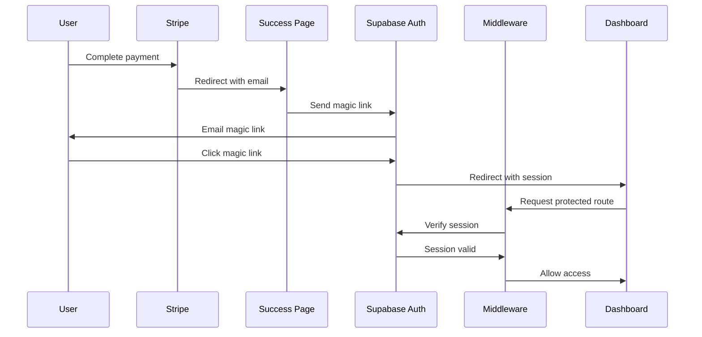

# Supabase Authentication Guide

This document provides detailed instructions for setting up and configuring Supabase authentication for Speasy.

## Overview

Speasy uses Supabase for user authentication and database storage. The application implements a passwordless authentication flow using magic links. After a user completes payment with Stripe, they receive a magic link to access their account.

## Client Implementation

The application uses different Supabase clients for different contexts:

1. **Client Components**:
   ```typescript
   import { createClient } from '@/lib/supabase'
   
   // In your component
   const supabase = createClient()
   ```

2. **Server Components**:
   ```typescript
   import { createServerComponentClient } from "@supabase/auth-helpers-nextjs"
   import { cookies } from "next/headers"
   
   // In your server component
   const supabase = createServerComponentClient({ cookies })
   ```

3. **API Routes and Server Actions**:
   ```typescript
   import { createAdminClient } from '@/lib/server-only'
   
   // In your API route or server action
   const supabase = createAdminClient()
   ```

## Prerequisites

Before you begin, make sure you have:

1. A Supabase account and project
2. Access to your hosting environment's environment variables
3. Your Stripe integration set up (see the [Stripe Integration Guide](./stripe-integration.md))

## Setup Instructions

### 1. Supabase Project Setup

1. **Create a Supabase Project**:
   - Sign up at [supabase.com](https://supabase.com) if you haven't already.
   - Create a new project.
   - Note your project's URL and API keys.

2. **Configure Authentication Settings**:
   - Go to **Authentication > Settings** in your Supabase dashboard.
   - Under **Email Auth**, enable "Email Confirmation" for passwordless sign-ins.
   - Set up your site URL and redirect URLs:
     - Site URL: `https://your-domain.com`
     - Redirect URLs: 
       - `https://your-domain.com/dashboard`
       - `http://localhost:3000/dashboard` (for local development)

3. **Set Up Email Provider** (Optional):
   - By default, Supabase uses a built-in email service, but for production, you should set up a custom email provider.
   - Go to **Authentication > Email Templates**.
   - Customize the "Magic Link" email template.

### 2. Environment Variables Configuration

Add the following variables to your `.env.local` file (if not already present):

```
NEXT_PUBLIC_SUPABASE_URL=https://your-project-id.supabase.co
NEXT_PUBLIC_SUPABASE_ANON_KEY=your-anon-key
SUPABASE_SERVICE_ROLE_KEY=your-service-role-key
```

### 3. Database Schema Setup

1. Run the migration script to create the necessary tables:

```sql
-- Create users table if it doesn't exist
CREATE TABLE IF NOT EXISTS users (
  id UUID PRIMARY KEY DEFAULT gen_random_uuid(),
  email TEXT UNIQUE NOT NULL,
  created_at TIMESTAMP WITH TIME ZONE DEFAULT now(),
  updated_at TIMESTAMP WITH TIME ZONE DEFAULT now(),
  stripe_customer_id TEXT,
  subscription_status TEXT,
  subscription_end_date TIMESTAMP WITH TIME ZONE
);

-- Create or modify auth user trigger
CREATE OR REPLACE FUNCTION public.handle_new_user() 
RETURNS trigger AS $$
BEGIN
  INSERT INTO public.users (id, email)
  VALUES (new.id, new.email)
  ON CONFLICT (email) 
  DO UPDATE SET
    id = EXCLUDED.id;
  RETURN new;
END;
$$ LANGUAGE plpgsql SECURITY DEFINER;

-- Make sure trigger exists
DROP TRIGGER IF EXISTS on_auth_user_created ON auth.users;
CREATE TRIGGER on_auth_user_created
  AFTER INSERT ON auth.users
  FOR EACH ROW EXECUTE PROCEDURE public.handle_new_user();
```

### 4. Authentication Implementation

The login page implements the magic link flow:

```typescript
// app/auth/login/page.tsx
async function handleLogin(email: string) {
  try {
    const supabase = createClient()
    const { error } = await supabase.auth.signInWithOtp({
      email,
      options: {
        emailRedirectTo: `${window.location.origin}/auth/callback`,
      },
    })

    if (error) {
      throw error
    }

    // Show success message
  } catch (error) {
    // Handle error
  }
}
```

### 5. Protected Routes Setup

1. Create a middleware file to protect routes:

```typescript
// middleware.ts
import { createMiddlewareClient } from "@supabase/auth-helpers-nextjs"
import { NextResponse } from "next/server"
import type { NextRequest } from "next/server"

export async function middleware(req: NextRequest) {
  const res = NextResponse.next()
  const supabase = createMiddlewareClient({ req, res })

  // Refresh session
  const { data: { session } } = await supabase.auth.getSession()

  // Protected routes
  if (req.nextUrl.pathname.startsWith('/dashboard')) {
    if (!session) {
      return NextResponse.redirect(new URL('/auth/login', req.url))
    }
  }

  // Auth routes
  if (req.nextUrl.pathname.startsWith('/auth/login')) {
    if (session) {
      return NextResponse.redirect(new URL('/dashboard', req.url))
    }
  }

  return res
}

export const config = {
  matcher: ['/dashboard/:path*', '/auth/:path*'],
}
```

## Auth Flow Diagram



## Middleware Implementation

```typescript
export async function middleware(req: NextRequest) {
  const res = NextResponse.next()
  const supabase = createMiddlewareClient({ req, res })

  // Handle auth error parameters in the URL hash
  const url = new URL(req.url)
  if (url.hash && url.hash.includes('error=')) {
    const errorParams = new URLSearchParams(url.hash.substring(1))
    const error = errorParams.get('error')
    const errorCode = errorParams.get('error_code')
    const errorDescription = errorParams.get('error_description')

    if (error || errorCode || errorDescription) {
      const errorUrl = new URL('/auth/error', req.url)
      errorUrl.searchParams.set('error', error || '')
      errorUrl.searchParams.set('error_code', errorCode || '')
      errorUrl.searchParams.set('error_description', errorDescription || '')
      return NextResponse.redirect(errorUrl)
    }
  }

  // Refresh session
  const { data: { session } } = await supabase.auth.getSession()

  // Protected routes
  if (req.nextUrl.pathname.startsWith('/dashboard')) {
    if (!session) {
      return NextResponse.redirect(new URL('/auth/login', req.url))
    }
  }

  // Auth routes
  if (req.nextUrl.pathname.startsWith('/auth/login')) {
    if (session) {
      return NextResponse.redirect(new URL('/dashboard', req.url))
    }
  }

  return res
}
```

## Troubleshooting

### Magic Link Issues

- Check the Supabase logs for authentication errors.
- Verify email delivery by checking spam folders.
- Ensure redirect URLs are correctly configured in Supabase.

### Authentication State Issues

- Clear browser local storage if you encounter persistent auth state issues.
- Check that the middleware is correctly configured.
- Ensure the Supabase client is initialized correctly.

### Database Issues

- Verify the trigger is correctly set up to create user records.
- Check for errors in the database logs.
- Ensure the database schema matches the expected structure.

## Security Considerations

1. Regularly rotate your Supabase API keys.
2. Use Row Level Security (RLS) policies to protect your data.
3. Implement proper error handling to avoid leaking sensitive information.
4. Consider adding additional authentication factors for sensitive actions.

## Further Resources

- [Supabase Authentication Documentation](https://supabase.com/docs/guides/auth)
- [Magic Link Authentication Guide](https://supabase.com/docs/guides/auth/passwordless-login/auth-magic-link)
- [Row Level Security Guide](https://supabase.com/docs/guides/auth/row-level-security)
- [Next.js Authentication Documentation](https://nextjs.org/docs/authentication)    